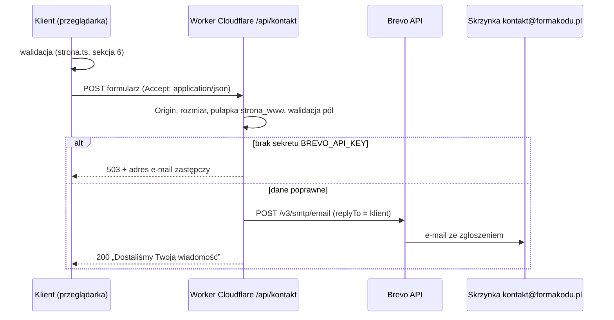
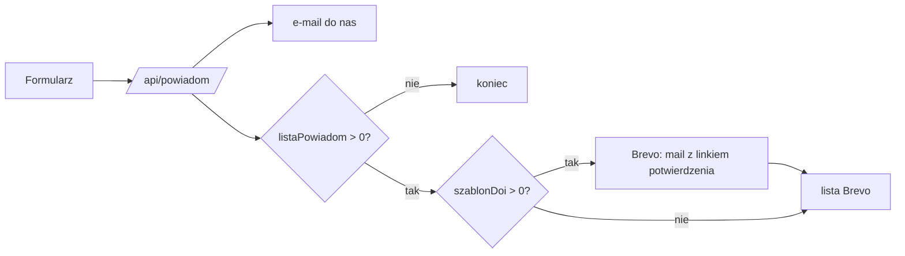
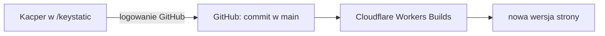

# Przepływy

## Formularz „Opisz projekt”

```mermaid
sequenceDiagram
  participant K as Klient (przeglądarka)
  participant W as Worker Cloudflare /api/kontakt
  participant B as Brevo API
  participant S as Skrzynka kontakt@formakodu.pl
  K->>K: walidacja (strona.ts, sekcja 6)
  K->>W: POST formularz (Accept: application/json)
  W->>W: Origin, rozmiar, pułapka strona_www, walidacja pól
  alt brak sekretu BREVO_API_KEY
    W-->>K: 503 + adres e-mail zastępczy
  else dane poprawne
    W->>B: POST /v3/smtp/email (replyTo = klient)
    B->>S: e-mail ze zgłoszeniem
    W-->>K: 200 „Dostaliśmy Twoją wiadomość”
  end
```

## „Powiadom mnie”

```mermaid
flowchart LR
  F[Formularz] --> W[/api/powiadom/]
  W --> M[e-mail do nas]
  W --> L{listaPowiadom > 0?}
  L -- nie --> K[koniec]
  L -- tak --> D{szablonDoi > 0?}
  D -- tak --> DOI[Brevo: mail z linkiem potwierdzenia] --> LISTA[lista Brevo]
  D -- nie --> LISTA
```

## Panel treści

```mermaid
flowchart LR
  U[Kacper w /keystatic] -->|logowanie GitHub| G[GitHub: commit w main]
  G --> CB[Cloudflare Workers Builds] --> S[nowa wersja strony]
```
